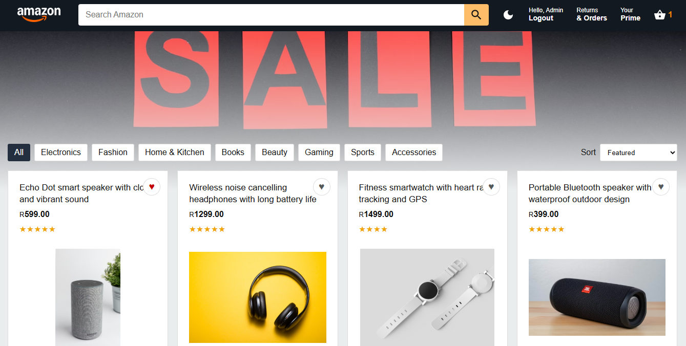
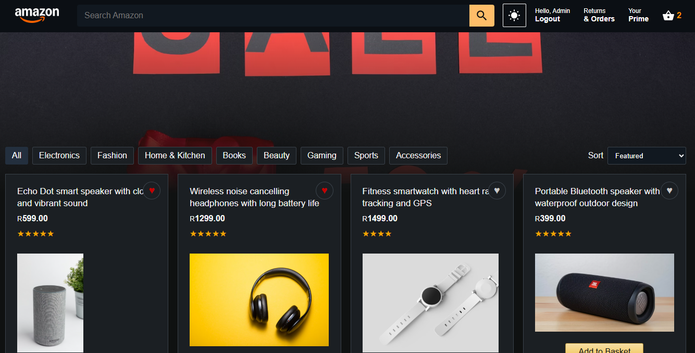
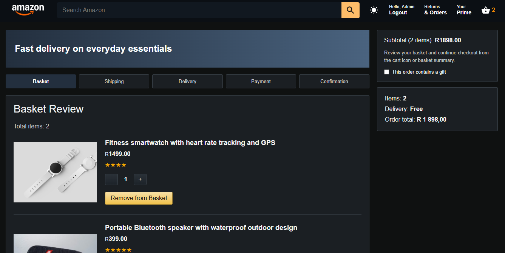
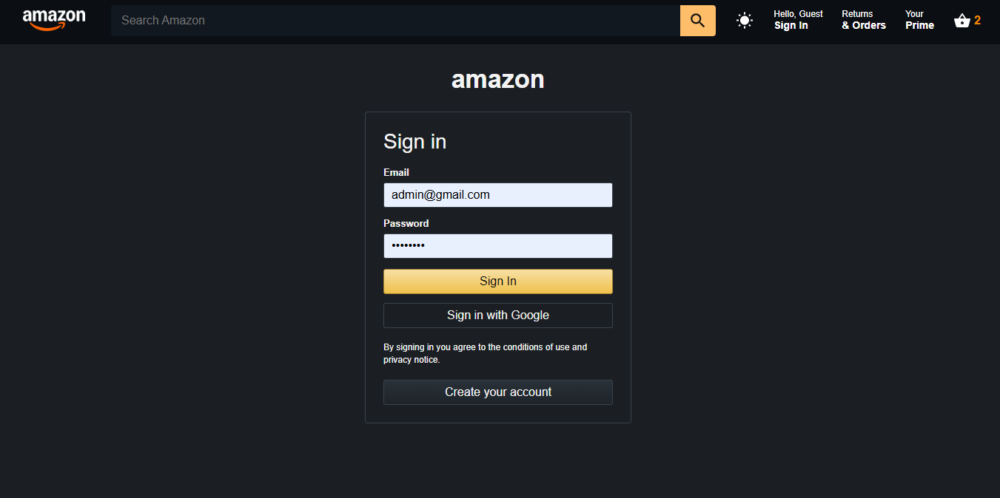
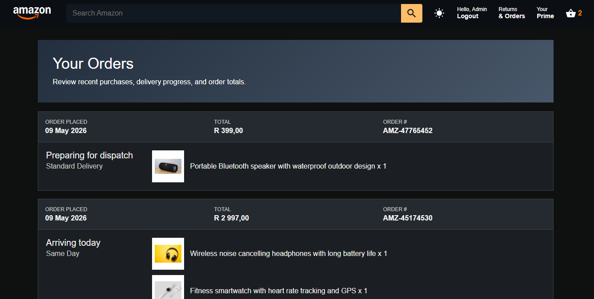
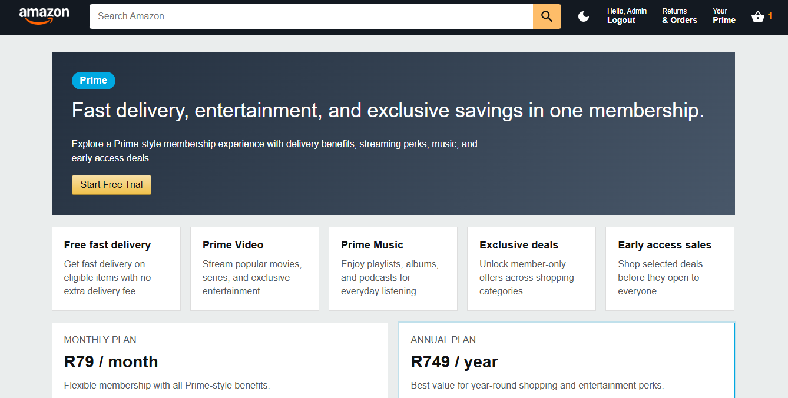

# Amazon Clone

A polished Amazon-style e-commerce application built with React, Vite, Firebase, React Router, Context API, and CSS3. The project is inspired by Amazon’s familiar shopping UI/UX and was developed as a full implementation of the **Amazon Clone using React** assignment requirements.

The app includes Firebase authentication, a persistent shopping basket, product discovery tools, wishlist support, dark mode, a multi-step checkout flow, simulated payment UI, and an order confirmation experience.

---

## Project Overview

Amazon Clone is a responsive React + Vite e-commerce application that recreates the core flow of a modern online shopping platform. Users can browse products, search and filter the catalog, add items to their basket, manage a wishlist, sign in with Firebase, and complete a full checkout journey.

The implementation follows the assignment milestones, focusing on component structure, reusable logic, and state management.

- React project setup with clean structure  
- React Router navigation system  
- Amazon-style header and homepage layout  
- Context API state management  
- Basket and checkout functionality  
- Firebase authentication  
- Firestore product support with fallback dataset  
- Enhanced UI features aligned with assignment rubric  

---

## Features

### Core Features
- Responsive Amazon-style layout  
- Header and navigation bar  
- Search bar with live product filtering  
- Reusable product cards  
- Shopping basket system  
- Multi-step checkout flow  
- Firebase authentication  
- Basket persistence using `localStorage`  

---

### Custom Features
- Product category filtering  
- Wishlist system  
- Quantity selector in cart  

---

### Advanced Features
- Persistent dark mode  
- Product sorting (featured, price, rating)  
- Recommended products section  
- Simulated Stripe-style payment UI (no real payments)  
- Order confirmation screen  

---

## State Management

- React Context API  
- Reducer-based global state  
- Persistent basket state  
- Persistent wishlist state  
- Persistent dark mode preference  

---

## Backend Support

- Firebase Authentication  
- Google sign-in support  
- Firestore product loading support (optional)  
- Local fallback product dataset when Firebase is not configured  

---

## Tech Stack

- React  
- Vite  
- React Router DOM  
- React Context API  
- Firebase Authentication  
- Firestore (optional)  
- Material UI Icons  
- CSS3  
- `localStorage`  

---

## Project Structure

src/
  assets/
    logo.png
  components/
    Header.jsx
    Product.jsx
    CheckoutProduct.jsx
    Subtotal.jsx
    RecommendedProducts.jsx
  data/
    products.js
  pages/
    Home.jsx
    Login.jsx
    Signup.jsx
    Checkout.jsx
    NotFound.jsx
  firebase.js
  reducer.js
  StateProvider.js
  App.jsx
  main.jsx

---

## Installation

npm install  
npm run dev  
npm run build  
npm run lint  

---

## Firebase Setup

VITE_FIREBASE_API_KEY=  
VITE_FIREBASE_AUTH_DOMAIN=  
VITE_FIREBASE_PROJECT_ID=  
VITE_FIREBASE_STORAGE_BUCKET=  
VITE_FIREBASE_MESSAGING_SENDER_ID=  
VITE_FIREBASE_APP_ID=  

Firebase Features:
- Email/password authentication  
- Google sign-in  
- Optional Firestore integration  

If Firebase is not configured, the app safely falls back to local product data.

---

## 📸 Screenshots

### Home Page

### Dark Mode

### Cart

### Login Page

### Returns & Orders

### Prime Page

---

## Rubric Coverage

Base Project — Implemented  
Responsiveness — Implemented  
Custom Feature — Implemented  
Advanced Features — Implemented  
Deployment Ready — Build-ready (Netlify/Firebase supported)  

---

## Future Improvements

- Real Stripe payments  
- Order history backend  
- Admin dashboard  
- Product reviews  
- Coupons system  
- Inventory management  

---

## Author

Built by Kamogelo Legae.

This project demonstrates a structured React e-commerce application focused on UI/UX, state management, and real-world frontend architecture patterns.s
